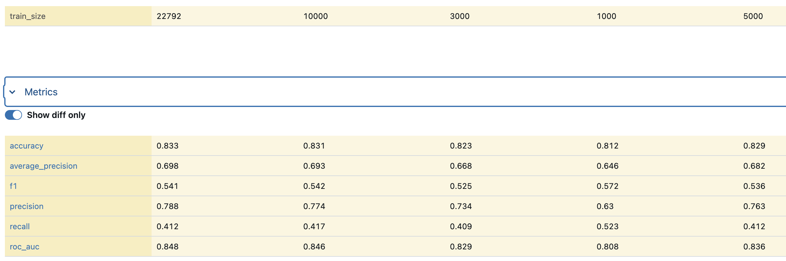
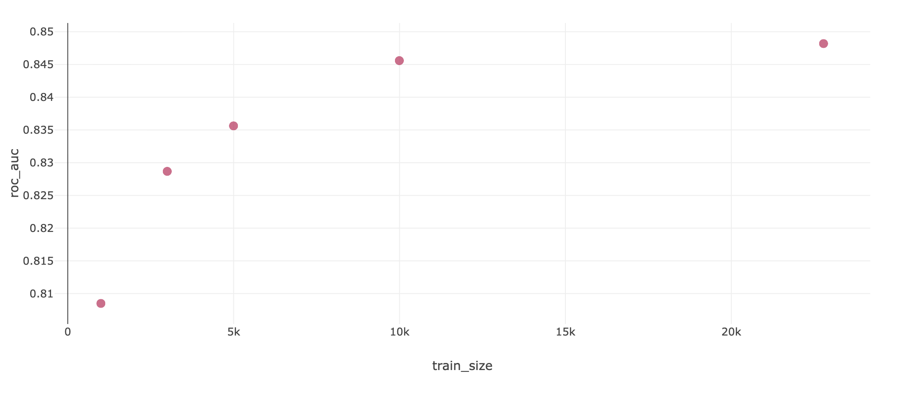
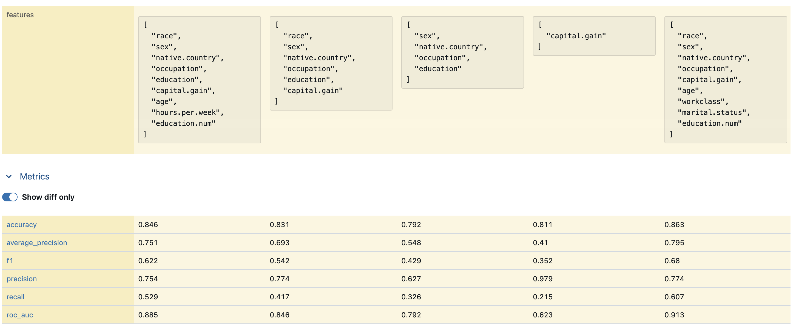
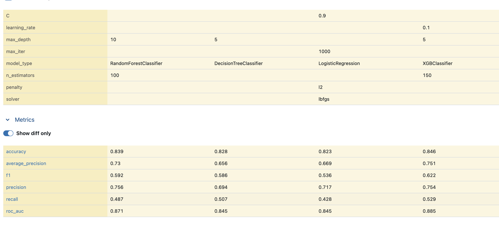
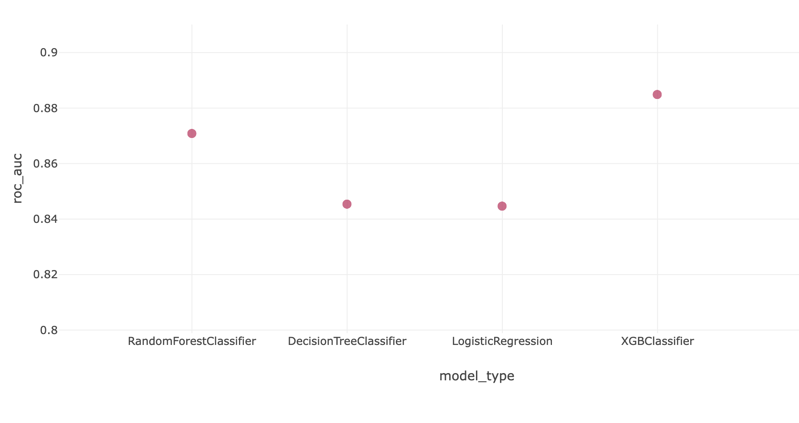
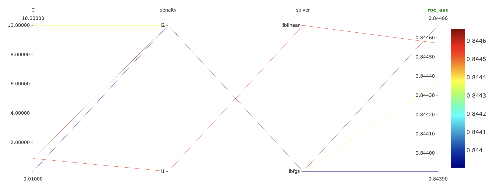
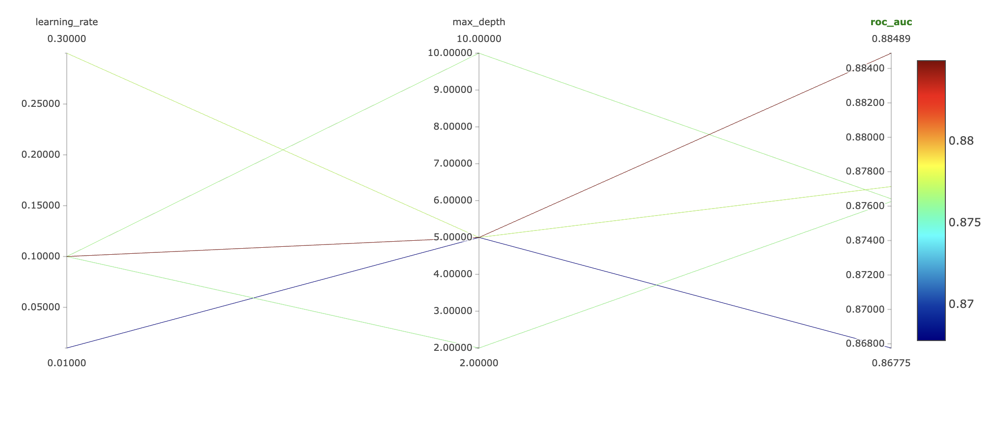
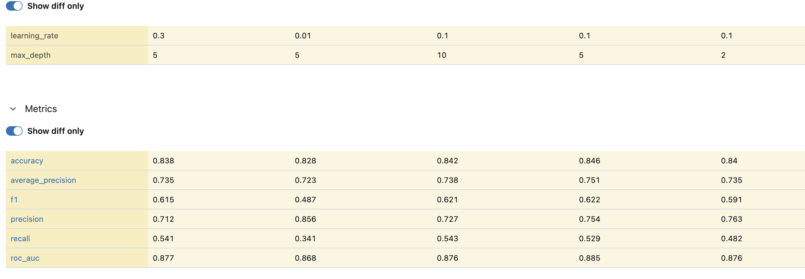
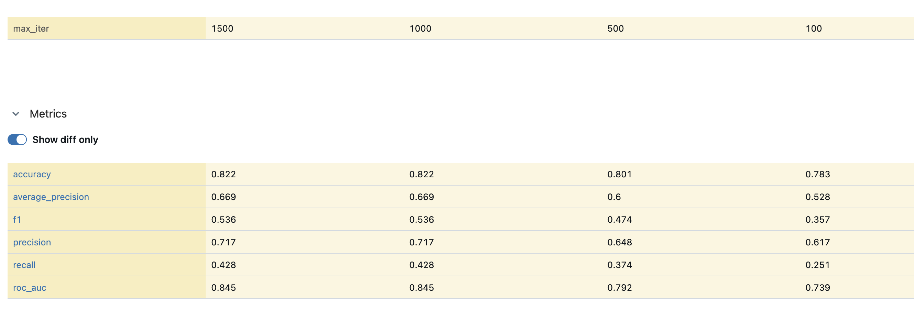

# Отчёт по экспериментам

Эксперимент: `homework_radilkhanova`\
MLflow: http://158.160.2.37:5000/

---

## Разрез 1: Размер датасета

**Гипотеза:** увеличение размера тренировочного датасета повышает качество модели (метрики accuracy, f1, roc_auc), тк модель получает больше информации о закономерностях в данных.

**Исследуемый параметр:** `train_size` в `params/process_data.yaml`

**Сетка значений:** 1000, 3000, 5000, 10000, null (весь датасет около 22800)

**Фиксированные параметры:**
- Модель: XGBClassifier (n_estimators= 150, max_depth= 5, learning_rate=0.1)
- Фичи: race, sex, native.country, occupation, education, capital.gain

| № запуска | train_size | roc_auc | 
|-----------|-----------|----------|
| 1         | 1000      |  0.808   |
| 2         | 3000      |  0.829   |
| 3         | 5000      |  0.836   |
| 4         | 10000     |  0.846   |
| 5         | null      |  0.848   |

Остальные метрики представлены в таблице ниже + график для наглядности

**Вывод:**  Лучше всего показал себя размер трейна равный 10000, выбор всего датасета дал незначительное улушение метрики, так что брать весь будто бы не имеет смысла и можно остановиться на 10к.

---

## Разрез 2: Набор фичей

**Гипотеза:** добавление большего количества признаков улучшает качество модели, так как модель получает больше сигналов для разделения классов. Хотя добавление нерелевантных фичей может не дать улучшения или даже ухудшить результат.

**Исследуемый параметр:** `features` в `params/process_data.yaml`

**Варианты наборов фичей:**
1. Минимальный набор (только числовой признак): `[capital.gain]`
2. Только категориальные: `[native.country, sex, occupation, education]`
3. Базовый (6 фичей): `[race, sex, native.country, occupation, education, capital.gain]`
4. Расширенный (9 фичей): `[race, sex, native.country, occupation, education, capital.gain, age, hours.per.week, education.num]`
5. Расширенный_2 (9 фичей): `['race', 'sex', 'native.country', 'occupation', 'capital.gain', 'age', 'workclass', 'marital.status', 'education.num']`

**Фиксированные параметры:**
- Модель: XGBClassifier (n_estimators= 150, max_depth= 5, learning_rate=0.1)
- train_size: 10000

| № запуска | набор фичей         | кол-во фичей | roc_auc | 
|-----------|---------------------|-------------|----------|
| 6         | только capital.gain | 1           |  0.623   | 
| 7         | категориальные      | 4           |  0.792   |
| 8         | базовый             | 6           |  0.846   |
| 9         | расширенный         | 9           |  0.885   |
| 9         | расширенный_2       | 9           |  0.913   |

**Вывод:** расширенный набор фичей дает лучшее значение метрики, но важно выбрать наиболее релевантные признаки (так расширенный_2 с немного измененным выбором дал результат лучше, чем расширенный) 

Ниже таблица с подробными результатами и график

---

## Разрез 3: Тип модели

**Гипотеза:** более сложные модели (ансамблевые методы, градиентный бустинг) показывают лучшее качество по сравнению с линейными моделями на данном датасете, тк могут улавливать нелинейные зависимости.

**Исследуемый параметр:** `model_type` в `params/train.yaml`

**Варианты моделей:**
1. LogisticRegression (penalty=l2, C=0.9, solver=lbfgs, max_iter=1000)
2. DecisionTreeClassifier (max_depth=5)
3. RandomForestClassifier (n_estimators=100, max_depth=10)
4. XGBClassifier (n_estimators=100, max_depth=3, learning_rate=0.1)

**Фиксированные параметры:**
- Фичи: расширенный набор (9 фичей)
- train_size: 10000

| № запуска | model_type              | roc_auc |
|-----------|------------------------|----------|
| 10        | LogisticRegression      |  0.845   |
| 11        | DecisionTreeClassifier  |  0.845   |
| 12        | RandomForestClassifier  |  0.871   |
| 13        | XGBClassifier           |  0.885   |

**Вывод:** Лучше всего, как и предполагалось, себя показала модель градиентного бустинга (XGBClassifier), немного отсатает от нее ансамблевый метод (случайный лес), логистическая регрессия и деревья показали практически одинаковый рзультат и делят третье место

Ниже табличка и графики

---

## Разрез 4: Параметры модели

### 4а: LogisticRegression — тип регуляризации, коэффициент, алгоритм оптимизации

**Гипотеза:** тип и сила регуляризации влияют на качество логистической регрессии, l1 регуляризация выполняет отбор признаков и может быть полезна при наличии нерелевантных фичей. Уменьшение коэффициента C (усиление регуляризации) снижает переобучение, но может привести к недообучению.

**Исследуемые параметры:** `penalty`, `C`, `solver` в `params/train.yaml`

**Варианты:**
1. penalty=l2, C=0.01, solver=lbfgs (сильная l2 регуляризация)
2. penalty=l2, C=0.9, solver=lbfgs (слабая l2-регуляризация)
3. penalty=l2, C=10.0, solver=lbfgs (очень слабая l2 регуляризация)
4. penalty=l1, C=0.9, solver=liblinear (l1 регуляризация)

**Фиксированные параметры:**
- Модель: LogisticRegression, max_iter=1000
- Фичи: раширенный набор (9 фичей)
- train_size: 10000

| № запуска | penalty | C    | solver    | roc_auc | 
|-----------|---------|------|-----------|----------|
| 14        | l2      | 0.01 | lbfgs     |  0.844   |
| 15        | l2      | 0.9  | lbfgs     |  0.845   |
| 16        | l2      | 10.0 | lbfgs     |  0.844   |
| 17        | l1      | 0.9  | liblinear |  0.845   |

**Вывод:** Округленные результаты получились практически олинаковые, на графике ниже видно чуть нагляднее, как параметры влияют на на качество модели: и в l2, и в l1 регуляризации лучше себя показывает коэффициент 0.9, и в выборе регуляризации l2 выигрывает незначительное преимущество 

График

### 4б: XGBClassifier — глубина деревьев и learning_rate

**Гипотеза:** увеличение глубины деревьев (max_depth) позволяет модели улавливать более сложные зависимости, но повышает риск переобучения. Уменьшение скорости обучения (learning_rate) делает обучение более плавным и точным, но требует большего числа итераций для сходимости.

**Исследуемые параметры:** `max_depth`, `learning_rate` в `params/train.yaml`

**Варианты:**
1. max_depth=2, learning_rate=0.1 (мелкие деревья, стандартный lr)
2. max_depth=5, learning_rate=0.1 (средние деревья, стандартный lr)
3. max_depth=10, learning_rate=0.1 (глубокие деревья, стандартный lr)
4. max_depth=5, learning_rate=0.01 (средние деревья, маленький lr)
5. max_depth=5, learning_rate=0.3 (средние деревья, большой lr)

**Фиксированные параметры:**
- Модель: XGBClassifier, n_estimators=150
- Фичи: расширенный набор (9 фичей)
- train_size: 10000

| № запуска | max_depth | learning_rate | roc_auc | 
|-----------|-----------|---------------|----------|
| 18        | 2         | 0.1           |  0.876   |
| 19        | 5         | 0.1           |  0.885   |
| 20        | 10        | 0.1           |  0.876   |
| 21        | 5         | 0.01          |  0.868   |
| 22        | 5         | 0.3           |  0.877   |

**Вывод:** Лучше всего себя показывает седняя глубина деревьев и стандартный шаг

---

## Разрез 5: Гиперпараметры обучения

### 5а: LogisticRegression — максимальное число итераций

**Гипотеза:** увеличение максимального числа итераций обучения (max_iter) позволяет оптимизатору лучше сойтись, это улучшает качество модели до определённого предела, после которого метрики выходят на плато.

**Исследуемый параметр:** `max_iter` в `params/train.yaml`

**Сетка значений:** 10, 50, 100, 500, 1000

**Фиксированные параметры:**
- Модель: LogisticRegression (penalty=l2, C=0.9, solver=lbfgs)
- Фичи: расширенный набор (9 фичей)
- train_size: 10000

| № запуска | max_iter | roc_auc | 
|-----------|----------|----------|
| 24        | 100      |  0.739   |
| 25        | 500      |  0.792   |
| 26        | 1000     |  0.845   |
| 27        | 1500     |  0.845   |

**Вывод:** 1000 итераций - оптимальное значение, тк дальнейшее увеличение их количества не приводит к улушению метрики

---

## Общий вывод

В итоге лучший результат (roc-auc=0.913) показала модель XGBClassifier с параметрами n_estimators=150, max_depth = 5, lr=0.1, features=`['race', 'sex', 'native.country', 'occupation', 'capital.gain', 'age', 'workclass', 'marital.status', 'education.num']` и train_size=10000 
