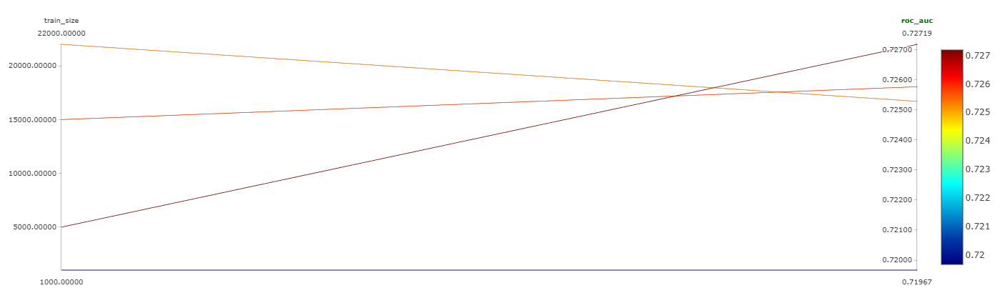
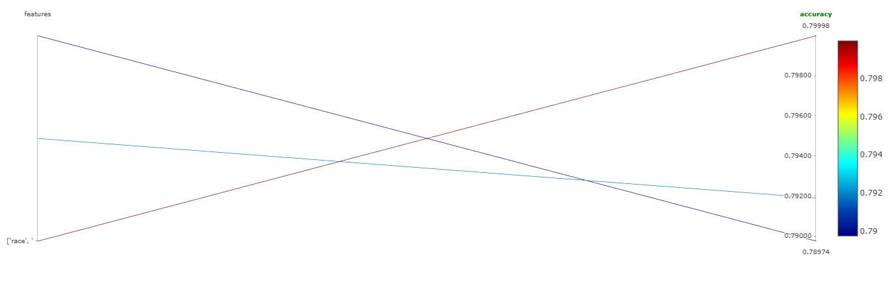
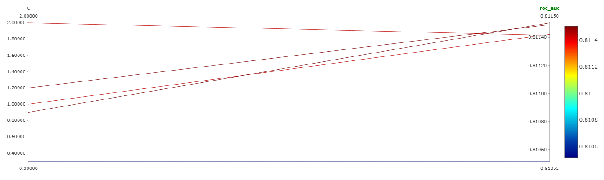

# Тестирование гипотез

## Гипотеза: Увеличение размера обучающей выборки повышает качество модели

Параметр train_size

Посмотрим на несколько значений:

1) 1000
2) 5000
3) 15000
4) 22000

График из MLflow

Видим что при train size = 5000 выходит самое лучшее значение Roc-auc

Ссылка на лучший ROC-AUC http://158.160.2.37:5000/#/experiments/25/runs/fa52af00290a4145a145b7ef1d26d839

## Гипотеза: Добавление числовых признаков, связанных с занятостью, улучшит предсказательную способность.

Перед этим зафиксируем train size на 5000

1)  Добавим 'age'	(Возраст сильно коррелирует с доходом)
2)	Добавим'hours.per.week'	Чем больше работаешь, тем выше вероятность дохода >50K.
3)	Добавим 'capital.loss'

Получаем лучший ROC-AUC в последним запуске http://158.160.2.37:5000/#/experiments/25/runs/9b589b7feae8443eaeb1ed8ad2d3f3bc

Эти фичи действительно все три стоит оставить - они очень хорошо импактят

## Гипотеза: Изменение силы регуляризации C поможет найти баланс между недообучением и переобучением.

1) С = 0.3
2) C = 1
3) C = 0.9
4) C = 1.2
5) C = 2

При С = 0.9 достигается лучший результат по ROC-AUC

Ссылка http://158.160.2.37:5000/#/experiments/25/runs/0a8e8dd2ba624282b90f9ced7e25dcf5

Этот эксперимент собственно говоря и будет лучшей моделью которую удалось получить по ROC-AUC 

