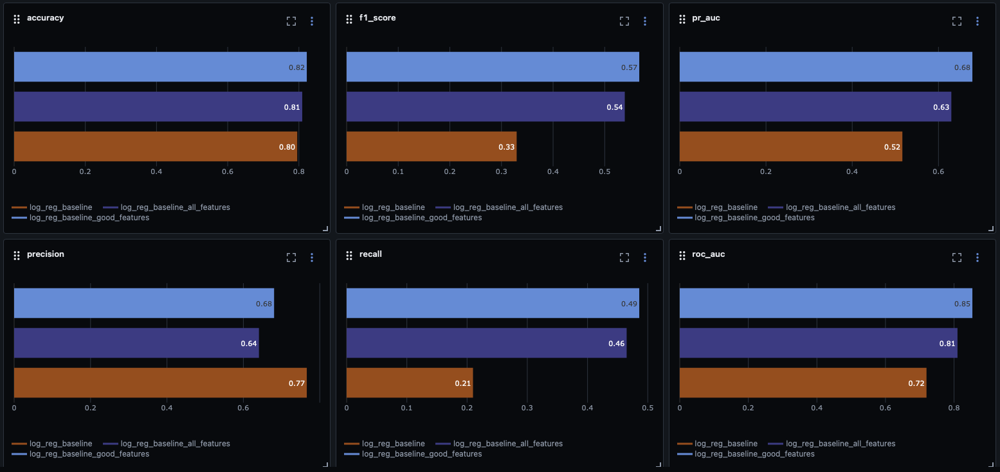
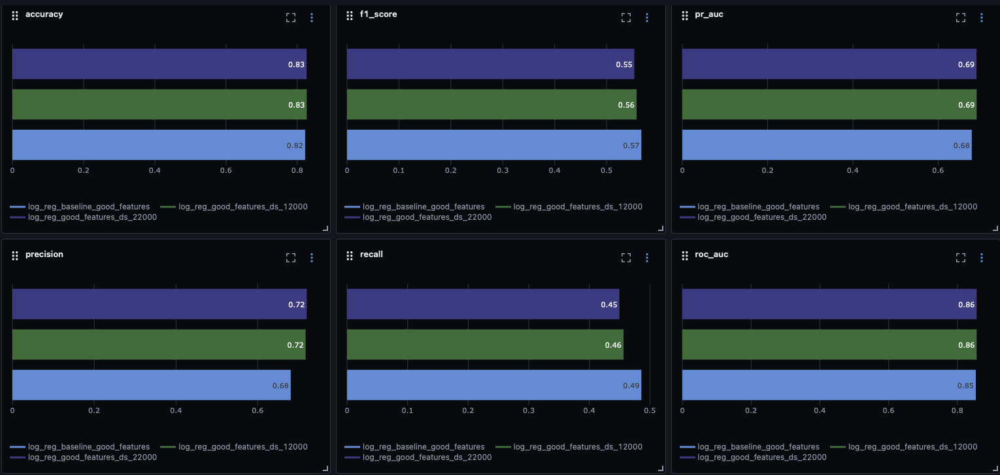
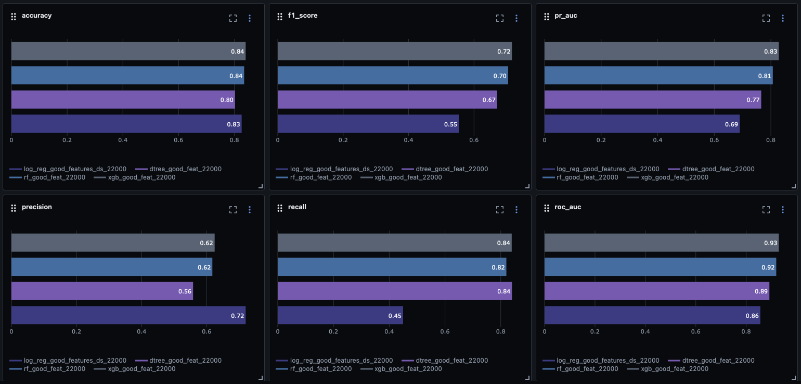
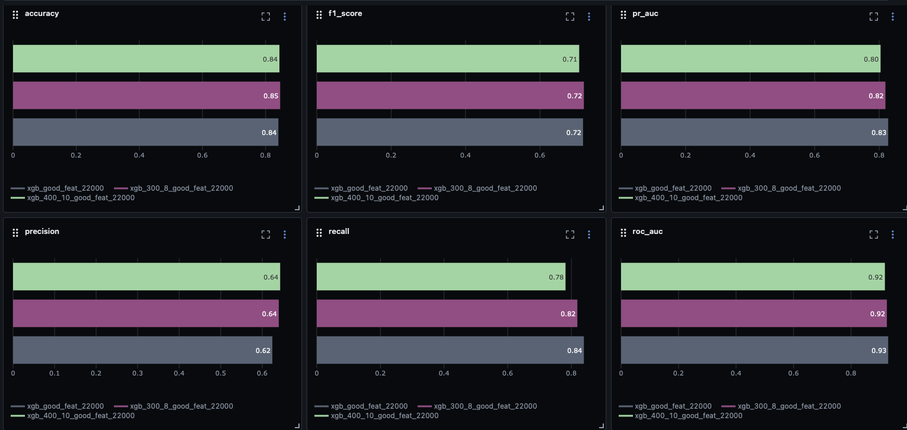

# Experiments analysis

## Эксперименты с наборами фичей 

**Гипотеза:** если брать наибольшее кол-во фичей, но при этом оставляя только релевантные, то качество предсказаний будет наилучшим

**Параметр:** набор фичей

**Берем три сета фичей:**
1. изначальный набор
2. все фичи
3. из всего набора, убраны дублирующиеся/"шумные" фичи

**Вывод:** Видно, что с увеличением кол-ва фичей улучшается качество предсказаний, но только если почистить от ненужных/мусорных фичей. При этом мы значимо просели по `precision` (но это уже надо изучать)

[best run](http://158.160.2.37:5000/#/experiments/26/runs/1e8553632e444bd7829b7616dfd44dca)

## Эксперименты с размером датасета

**Гипотеза:** чем больше объектов в тренировочной выборке тем лучше качество предсказаний

**Параметр:** размер датасета

**3 размера датасета:**
1. изначальный набор (1000)
2. 12 000
3. 22 000

**Вывод:** Видно, что при увеличении размера тренировочной выборки увеличивается `precision` и `pr-auc`, но падает `recall` и `f1`, это связанно с тем, что в выборки попали разные данные и распределения фичей также разное, но при этом довольно схожее, т.к. изменения большинства метрик небольшие.

[best run](http://158.160.2.37:5000/#/experiments/26/runs/bd8c1c1bc2a64197b96a0b1e97fd9a3d)

## Эксперименты с типом модели

**Гипотеза:** xgb работает лучше, чем случ.лес, а случ.лес лучше, чем дерево, а дерево лучше, чем логрег -> `xgb > rand forest > dec tree > logreg`

**Параметр:** тип модели

**4 модели:**
1. LogisticRegression
2. DecisionTreeClassifier
3. RandomForestClassifier
4. XGBClassifier

**Вывод:** Что и требовалось доказать, но видно, что `precision` на `logreg` довольно высокий, а на остальных пониже, и наоборот для `recall`

[best run](http://158.160.2.37:5000/#/experiments/26/runs/fab08cbfb9674769b6c0f6de5a9b4095)

## Эксперименты с гиперпараметры модели

**Гипотеза:** xgb показывает лучшие результаты среди всех моделей, но его гиперпараметры требуют тонкой настройки для улучшения качества, попробуем увеличивать кол-во деревьев и увеличивать глубину

**Параметр:** гиперпараметры модели

**3 конфига:**
1. исходный (**n_estimators:** 200 | **max_depth:** 6)
2. **n_estimators:** 300 | **max_depth:** 8
3. **n_estimators:** 400 | **max_depth:** 10

**Вывод:** Гипотеза об увеличении кол-ва деревьев и глубины опровергнулась, т.к. практически все метрики пошли на спад, кроме `precision`.

[best run](http://158.160.2.37:5000/#/experiments/26/runs/fab08cbfb9674769b6c0f6de5a9b4095)

