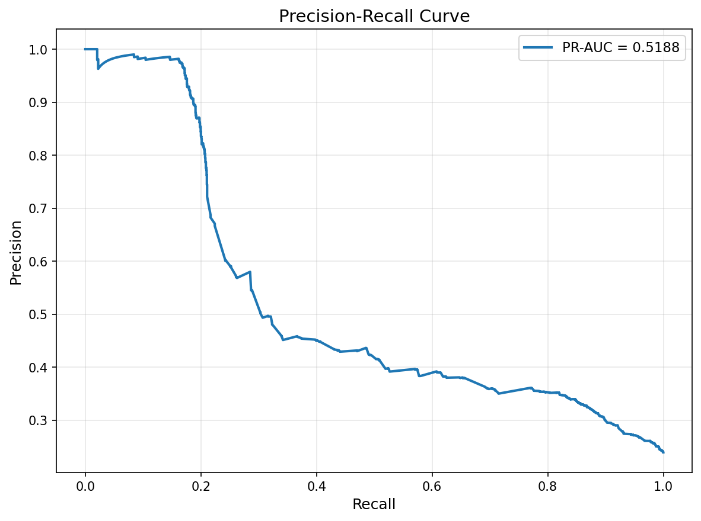
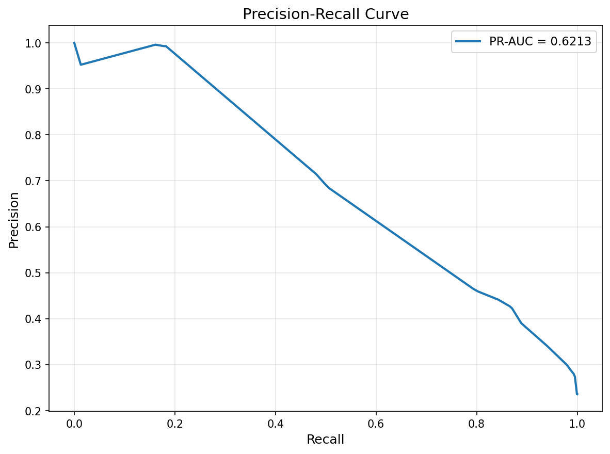
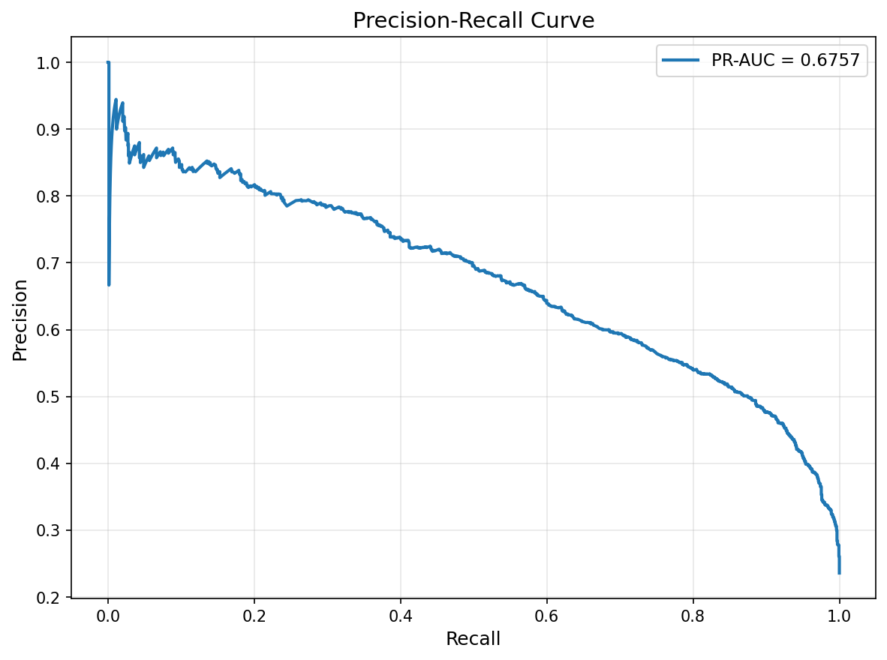

# Отчёт по экспериментам

## 1. Сравнение по размеру обучающего датасета

### Гипотеза
Чем больше объектов в обучающей выборке, тем лучше метрики

### Параметры
- Размер тренировочного датасета: 22792 и 26048

### Результаты
   Run Name            | Train Size | Test Size | Accuracy | Precision | Recall | F1     | ROC-AUC | Average Precision |
 |---------------------|------------|-----------|----------|-----------|--------|--------|---------|-------------------|
 | glamorous-hare-545  | 22792      | 9769      | 0.798    | 0.812     | 0.205  | 0.328  | 0.725   | 0.519             |
 | caring-squid-852    | 22792      | 9769      | 0.798    | 0.812     | 0.205  | 0.328  | 0.725   | 0.519             |
 | wistful-cat-218     | 26048      | 6513      | 0.798    | 0.788     | 0.196  | 0.314  | 0.713   | 0.498             |

### Выводы
Увеличение размера тренировочного датасета не привело к значительному улучшению метрик. Возможно, для данного датасета и модели размер 22792 уже достаточен

---

## 2. Сравнение по используемым фичам

### Гипотеза
Разные комбинации признаков могут дать прирост в качестве

### Параметры
- Набор фичей: `['race', 'sex', 'native.country', 'occupation', 'education', 'capital.gain']`, `['age', 'sex', 'education.num', 'capital.gain', 'hours.per.week']`

### Результаты
 | Run Name            | Features                                                                                     | Accuracy | Precision | Recall | F1     | ROC-AUC | Average Precision |
 |---------------------|----------------------------------------------------------------------------------------------|----------|-----------|--------|--------|---------|-------------------|
 | wistful-cat-218     | ['race', 'sex', 'native.country', 'occupation', 'education', 'capital.gain']                  | 0.798    | 0.788     | 0.196  | 0.314  | 0.713   | 0.498             |
 | smiling-steed-747   | ['age', 'sex', 'education.num', 'capital.gain', 'hours.per.week']                            | 0.832    | 0.715     | 0.481  | 0.575  | 0.840   | 0.621             |
 | selective-gnu-738    | ['age', 'workclass', 'education', 'marital.status', 'occupation', 'relationship', 'sex', ...] | 0.863    | 0.772     | 0.597  | 0.674  | 0.915   | 0.802             |

### Выводы
Использование более разнообразных фич, таких как `age`, `workclass`, `education.num`, `marital.status`, `occupation`, `relationship`, `sex`, `capital.gain`, `capital.loss`, `hours.per.week`, значительно улучшает метрики модели

---

## 3. Сравнение по параметрам моделей

### Гипотеза
Изменение параметров моделей влияет на качество предсказаний

### Параметры
- Модели: LogisticRegression, DecisionTreeClassifier, RandomForestClassifier, GradientBoostingClassifier.
- Параметры: `penalty`, `C`, `solver`, `max_depth`, `n_estimators`, `learning_rate`.

### Результаты
 | Run Name            | Model                     | Parameters                                                                                     | Accuracy | Precision | Recall | F1     | ROC-AUC | Average Precision |
 |---------------------|---------------------------|------------------------------------------------------------------------------------------------|----------|-----------|--------|--------|---------|-------------------|
 | caring-squid-852       | LogisticRegression        | {'penalty': 'l2', 'C': 0.9, 'solver': 'lbfgs', 'max_iter': 1000, 'random_state': 42}              | 0.798     | 0.812      | 0.205   | 0.327   | 0.725    | 0.518              |
 | smiling-steed-747   | DecisionTreeClassifier    | {'max_depth': 5, 'random_state': 42}                                                            | 0.832    | 0.715     | 0.481  | 0.575  | 0.840   | 0.621             |
 | serious-grub-24    | RandomForestClassifier    | {'n_estimators': 100, 'max_depth': 10, 'random_state': 42}                                       | 0.83    | 0.682     | 0.526  | 0.594  | 0.878   | 0.675             |

### Графики PR-AUC

**PR-AUC для LogisticRegression (caring-squid-852)**

**PR-AUC для DecisionTreeClassifier (smiling-steed-747)**

**PR-AUC для RandomForestClassifier (serious-grub-24)**

### Выводы
Модель RandomForestClassifier с параметрами `n_estimators=50` и `max_depth=15` показала наилучшие результаты по метрике ROC-AUC.

---

## Лучший запуск
Лучший результат по метрике ROC-AUC: [selective-gnu-738](http://158.160.2.37:5000/#/experiments/29/runs/5fa69194c46e447bbc39e9fc7cad5fb0).