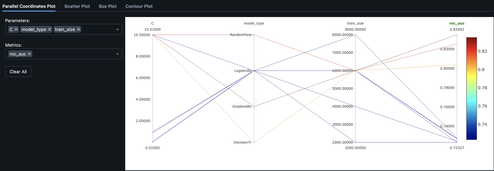

# Отчёт по результатам экспериментов

**Эксперимент MLflow:** `homework_lidzhiev`  
**Адрес MLflow:** http://158.160.2.37:5000/#/experiments/34  
**Автор:** Timur Lidzhiev

---

## Обзор экспериментов

На графике Parallel Coordinates ниже представлены все 12 запусков. По осям отложены ключевые параметры (C, model_type, train_size) и целевая метрика ROC-AUC. Цвет линий кодирует значение ROC-AUC — от синего (низкое) к красному (высокое).

На графике хорошо видно, что красные линии (высокий ROC-AUC) соответствуют моделям GradientBoosting и RandomForest, тогда как большинство синих линий — это запуски LogisticRegression с разными значениями C и train_size.

---

## Сводная таблица запусков

| # | Run Name | Модель | train_size | C | max_depth | n_estimators | lr | ROC-AUC | Accuracy | F1 |
|---|----------|--------|-----------|---|-----------|-------------|-----|---------|----------|-----|
| 1 | clumsy-deer-400 | LogisticRegression | 2000 | 0.9 | — | — | — | 0.7233 | 0.7962 | 0.3312 |
| 2 | grandiose-trout-163 | LogisticRegression | 4000 | 0.9 | — | — | — | 0.7245 | 0.7980 | 0.3291 |
| 3 | unequaled-cod-446 | LogisticRegression | 6000 | 0.9 | — | — | — | 0.7273 | 0.7979 | 0.3286 |
| 4 | delightful-stoat-296 | LogisticRegression | 8000 | 0.9 | — | — | — | 0.7278 | 0.7981 | 0.3288 |
| 5 | efficient-ray-117 | LogisticRegression | 6000 | 0.01 | — | — | — | 0.7234 | 0.7985 | 0.3283 |
| 6 | rumbling-trout-971 | LogisticRegression | 6000 | 0.1 | — | — | — | 0.7269 | 0.7981 | 0.3293 |
| 7 | industrious-wolf-440 | LogisticRegression | 6000 | 0.9 | — | — | — | 0.7273 | 0.7979 | 0.3286 |
| 8 | rumbling-kite-205 | LogisticRegression | 6000 | 1.0 | — | — | — | 0.7273 | 0.7979 | 0.3286 |
| 9 | hilarious-shrike-358 | LogisticRegression | 6000 | 10.0 | — | — | — | 0.7274 | 0.7979 | 0.3286 |
| 10 | loud-squid-243 | DecisionTree | 6000 | — | 10 | — | — | 0.8038 | 0.8154 | 0.5083 |
| 11 | gaudy-bat-296 | RandomForest | 6000 | — | 10 | 100 | — | 0.8256 | 0.8220 | 0.4975 |
| 12 | ambitious-crane-990 | GradientBoosting | 6000 | — | 5 | 100 | 0.1 | **0.8349** | 0.8289 | 0.5352 |

---

## Разрез 1: Влияние размера тренировочного датасета

### Описание

- **Гипотеза:** увеличение размера тренировочного датасета приводит к росту метрики ROC-AUC.
- **Исследуемый параметр:** `train_size`
- **Сетка значений:** 2000, 4000, 6000, 8000
- **Фиксированные параметры:** LogisticRegression, solver=lbfgs, penalty=l2, C=0.9, max_iter=1000, фичи — `['race', 'sex', 'native.country', 'occupation', 'education', 'capital.gain']`

### Результаты

| train_size | ROC-AUC | Accuracy | F1 | PR-AUC |
|-----------|---------|----------|-----|--------|
| 2000 | 0.7233 | 0.7962 | 0.3312 | 0.5186 |
| 4000 | 0.7245 | 0.7980 | 0.3291 | 0.5191 |
| 6000 | 0.7273 | 0.7979 | 0.3286 | 0.5220 |
| 8000 | 0.7278 | 0.7981 | 0.3288 | 0.5221 |

На общем графике Parallel Coordinates этим запускам соответствуют четыре синие линии с model_type = LogisticRegression, расходящиеся по оси train_size (2000–8000) и сходящиеся к близким значениям ROC-AUC (0.723–0.728).

### Выводы

Гипотеза **подтвердилась частично**. Наблюдается монотонный рост ROC-AUC с увеличением размера датасета: от 0.7233 (2000 сэмплов) до 0.7278 (8000 сэмплов). Однако прирост незначительный — всего +0.0045 (менее 1%). Это свидетельствует о том, что для линейной модели с данным набором фичей основной лимитирующий фактор — выразительная способность модели, а не объём данных.

---

## Разрез 2: Влияние коэффициента регуляризации (C)

### Описание

- **Гипотеза:** слишком малое значение C (сильная регуляризация) приводит к underfitting и снижению ROC-AUC, а при увеличении C метрика выходит на плато.
- **Исследуемый параметр:** `C` (обратная сила регуляризации в LogisticRegression)
- **Сетка значений:** 0.01, 0.1, 0.9, 1.0, 10.0
- **Фиксированные параметры:** LogisticRegression, solver=lbfgs, penalty=l2, train_size=6000, max_iter=1000

### Результаты

| C | ROC-AUC | Accuracy | F1 | PR-AUC |
|---|---------|----------|-----|--------|
| 0.01 | 0.7234 | 0.7985 | 0.3283 | 0.5189 |
| 0.1 | 0.7269 | 0.7981 | 0.3293 | 0.5212 |
| 0.9 | 0.7273 | 0.7979 | 0.3286 | 0.5220 |
| 1.0 | 0.7273 | 0.7979 | 0.3286 | 0.5220 |
| 10.0 | 0.7274 | 0.7979 | 0.3286 | 0.5220 |

На графике Parallel Coordinates этим запускам соответствуют линии, расходящиеся по оси C (0.01–10.0), но сходящиеся к практически одинаковым значениям ROC-AUC на правой оси.

### Выводы

Гипотеза **подтвердилась**. При очень сильной регуляризации (C=0.01) наблюдается заметное снижение ROC-AUC (0.7234 vs 0.7274 при C=10.0). При C ≥ 0.9 метрики практически не меняются — разница менее 0.0001. Модель не склонна к переобучению на данном датасете (вероятно, из-за линейности и небольшого числа признаков). Основной эффект регуляризации проявляется только при жёстких ограничениях (малые C).

---

## Разрез 3: Влияние типа модели

### Описание

- **Гипотеза:** ансамблевые модели (Random Forest, Gradient Boosting) покажут значительно лучшее качество по сравнению с линейной моделью и одиночным деревом за счёт способности моделировать нелинейные зависимости.
- **Исследуемый параметр:** `model_type`
- **Значения:** LogisticRegression, DecisionTree, RandomForest, GradientBoosting
- **Фиксированные параметры:** train_size=6000, фичи — `['race', 'sex', 'native.country', 'occupation', 'education', 'capital.gain']`

### Результаты

| Модель | ROC-AUC | Accuracy | F1 | Precision | Recall | PR-AUC |
|--------|---------|----------|-----|-----------|--------|--------|
| LogisticRegression (C=0.9) | 0.7273 | 0.7979 | 0.3286 | 0.8050 | 0.2064 | 0.5220 |
| DecisionTree (depth=10) | 0.8038 | 0.8154 | 0.5083 | 0.7023 | 0.3983 | 0.6068 |
| RandomForest (depth=10, n=100) | 0.8256 | 0.8220 | 0.4975 | 0.7681 | 0.3679 | 0.6624 |
| **GradientBoosting** (depth=5, n=100, lr=0.1) | **0.8349** | **0.8289** | **0.5352** | 0.7665 | **0.4111** | **0.6830** |

На графике Parallel Coordinates различие типов моделей наиболее наглядно: красная линия (GradientBoosting, ROC-AUC = 0.835) и тёмно-оранжевая (RandomForest, ROC-AUC = 0.826) резко отделяются от кластера синих линий (LogisticRegression, ROC-AUC ≈ 0.727).

### Выводы

Гипотеза **полностью подтвердилась**. Иерархия моделей по ROC-AUC:

1. **GradientBoosting — 0.8349** (лучший результат)
2. RandomForest — 0.8256
3. DecisionTree — 0.8038
4. LogisticRegression — 0.7273

Переход от линейной модели к градиентному бустингу дал прирост **+0.1076 ROC-AUC** (+14.8%). Это подтверждает наличие нелинейных зависимостей в данных. GradientBoosting также показал лучший баланс precision/recall (F1 = 0.535 vs 0.329 у LogReg).

---

## Лучший запуск

**Лучший результат по ROC-AUC: 0.8349**

- **Модель:** GradientBoosting (max_depth=5, n_estimators=100, learning_rate=0.1)
- **Run Name:** ambitious-crane-990
- **Run ID:** `599460c0cd904aa4992b72ad584f812f`
- **Ссылка:** [http://158.160.2.37:5000/#/experiments/34/runs/599460c0cd904aa4992b72ad584f812f](http://158.160.2.37:5000/#/experiments/34/runs/599460c0cd904aa4992b72ad584f812f)
