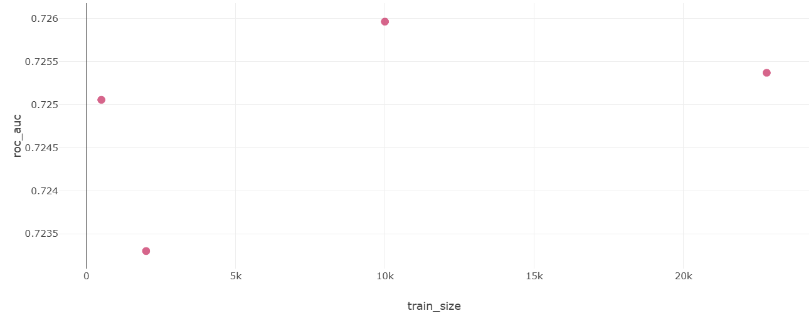
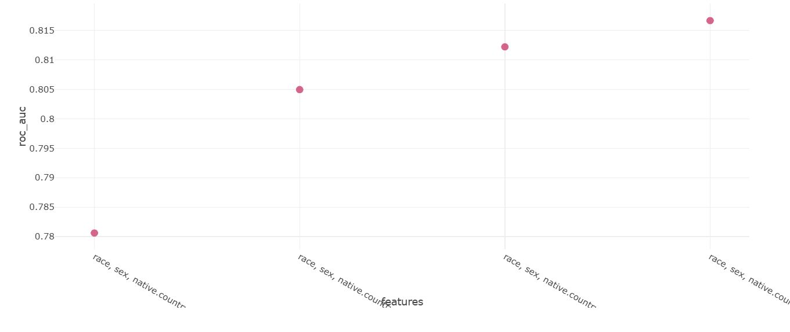
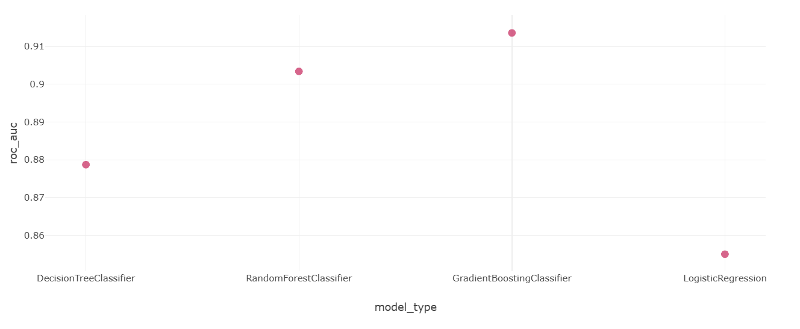
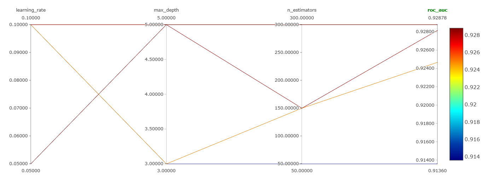

# Отчет по экспериментам MLflow

Ссылка на лучший запуск: http://158.160.2.37:5000/#/experiments/33/runs/9284ca478bcb42d1ba9613526722046b  
ROC-AUC = 0.9287813523578767  
все данные  
все фичи  
такие параметры модели:  
  model_type: GradientBoostingClassifier  
  n_estimators: 300  
  learning_rate: 0.05  
  max_depth: 5  

---

## разрез 1: влияние размера тренировочного датасета
Гипотеза: Увеличение размера тренировочного датасета повышает обобщающую способность модели и растит целевые метрики.  
Исследуемый параметр: `train_size`  
Как изменялся: По сетке: 500 -> 2000 -> 10000 -> Полный датасет(~22000 строк). Заморожена модель(LogisticRegression) и 6 базовых фичей.

График зависимости ROC-AUC от размера датасета:

Выводы: Гипотеза подтвердилась лишь частично. Как видно на графике, качество ROC-AUC не растет строго линейно при добавлении данных. Наблюдается локальная просадка при 2000 строках и пик при 10000, после чего на полном датасете метрика стабилизируется на уровне ~0.725. Это говорит о том, что простая линейная модель(логистическая регрессия) на базовых ненормализованных признаках быстро достигает «потолка» своей обобщающей способности. Для дальнейшего роста метрики требуется добавление новых признаков(разрез 2) или использование более сложных нелинейных алгоритмов(разрез 3).  

---

## Разрез 2: Влияние набора признаков  
Гипотеза: добавление новых смысловых признаков(особенно финансовых) даст модели больше сигнала для разделения классов и увеличит ROC-AUC.  
Исследуемый параметр: Список признаков `features`  
Как изменялся: Итеративное добавление: 6 базовых -> 8(+ финансовые) -> 10(+ социальные) -> 12 -> 14(все доступные признаки). Заморожена модель (LogisticRegression) и размер данных (все данные).

График зависимости ROC-AUC от набора фичей:

Выводы: Гипотеза полностью подтвердилась. На графике наблюдается строгий монотонный рост метрики ROC-AUC(с ~0.780 до ~0.816) по мере расширения пространства признаков. Это доказывает, что базовому набору признаков критически не хватало предсказательной силы. Добавление финансовых показателей  и социально-демографических характеристик позволило линейной модели найти гораздо более точную разделяющую гиперплоскость. Использование всех 14 признаков зафиксировано как оптимальное для дальнейших экспериментов.  

---

## Разрез 3: Сравнение алгоритмов машинного обучения
Гипотеза: Ансамбли на основе деревьев(случайный лес, градиентный бустинг) справятся с табличными ненормализованными данными лучше, чем линейная модель.  
Исследуемый параметр: `model_type`  
Как изменялся: DecisionTreeClassifier -> RandomForestClassifier -> GradientBoostingClassifier -> LogisticRegression(L1). Заморожен датасет (все данные) и фичи (все 14).

График сравнения ROC-AUC по алгоритмам:
  

Выводы: Гипотеза подтвердилась. На графике отчетливо видно превосходство древовидных ансамблей над линейными моделями на табличных данных. Логистическая регрессия показала наихудший результат(~0.855), так как данные содержат нелинейные зависимости, не отмасштабированы, а категориальные признаки закодированы простым OrdinalEncoder. Одиночное дерево решений(DecisionTreeClassifier) легко обошло регрессию(~0.879), а объединение деревьев в ансамбли дало максимальный прирост: случайный лес достиг ~0.903, а градиентный бустинг стал абсолютным лидером с показателем ROC-AUC ~0.913. Градиентный бустинг выбран как базовая модель для финального тюнинга гиперпараметров.  

---

## Разрез 4: Тюнинг гиперпараметров градиентного бустинга
Гипотеза: Увеличение количества деревьев с одновременным уменьшением learning_rate позволит улучшить качество ансамбля.  
Исследуемые параметры: `n_estimators`, `max_depth`, `learning_rate`  

Как изменялись:  
  1. Base: est=50, depth=3, lr=0.1
  2. Trees up: est=150, depth=3, lr=0.1
  3. Depth up: est=150, depth=5, lr=0.1
  4. Best: est=300, depth=5, lr=0.05

График тюнинга:
   

Выводы: Гипотеза полностью подтвердилась. На графике параллельных координат наглядно видно, как последовательное изменение гиперпараметров поднимает итоговую метрику. Самая нижняя траектория соответствует базовой модели(50 неглубоких деревьев с шагом 0.1), которая показала наименьший результат. По мере того как мы делали ансамбль сложнее - увеличивали количество деревьев до 150 и 300, а их глубину до 5 - линии на графике поднимались всё выше. Наилучший результат(~0.928) показала самая верхняя линия: комбинация из 300 глубоких деревьев с намеренно уменьшенным шагом обучения(lr = 0.05). Это показывает, что для достижения максимального качества градиентному бустингу требуется большое количество глубоких деревьев, которые обучаются плавно и с малым шагом, избегая переобучения