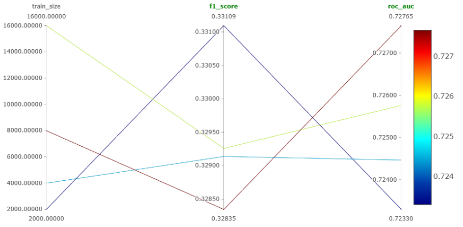
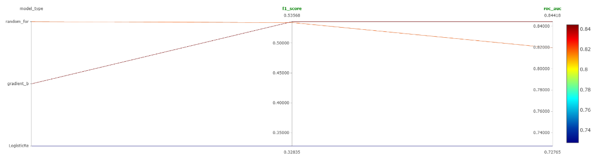
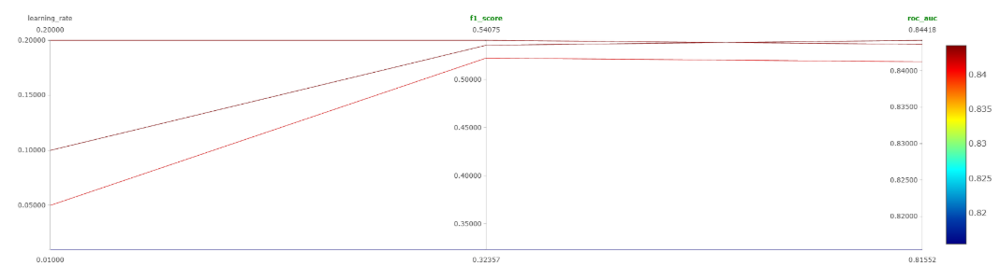

# MLflow эксперименты

## 1 Срез

**Гипотеза:**  
Увеличение размера тренировочного датасета повышает метрики модели.

**Параметр:**  
Размер тренировочного датасета (`train_size`)  

**Сетка значений:**  
2000, 4000, 8000, 16000 (шаг в геометрической прогрессии 2ⁿ)

| train_size | accuracy | f1_score | pr_auc | precision | recall | roc_auc |
|------------|----------|----------|--------|-----------|--------|---------|
| 2000       | 0.796    | 0.331    | 0.519  | 0.773     | 0.211  | 0.723   |
| 4000       | 0.798    | 0.329    | 0.519  | 0.805     | 0.207  | 0.724   |
| 8000       | 0.798    | 0.328    | 0.521  | 0.802     | 0.206  | 0.728   |
| 16000      | 0.798    | 0.329    | 0.520  | 0.800     | 0.207  | 0.726   |

**Анализ:**  
Малый train_size (2000) может давать чуть выше F1 из-за случайного распределения классов, но это ненадежный показатель.  
Лучший баланс качества показывает run с `train_size=8000` — у него лучшие показатели ROC-AUC, остальные метрики не хуже других.  

**Вывод:**  
Гипотеза не подтвердилась для данной выборки. Метрики демонстрируют выход на плато уже при размере выборки 4000–8000 объектов. Вероятной причиной является ограниченная сложность модели Logistic Regression и ограниченный набор признаков.

**Ссылка на MLflow:** [Run с train_size](http://158.160.2.37:5000/#/experiments/10/runs/49b04a18e49145bfb2d4517ac3787546)

---

## 2 Срез

**Гипотеза:**  
Ансамблевые модели (Random Forest и Gradient Boosting) покажут более высокие значения ROC-AUC и F1-score по сравнению с линейной моделью Logistic Regression.

**Параметр:**  
Тип модели: Logistic Regression, Random Forest, Gradient Boosting  

| model_type        | accuracy | f1     | pr_auc | precision | recall | roc_auc |
|------------------|----------|--------|--------|-----------|--------|---------|
| LogisticRegression | 0.798   | 0.328  | 0.521  | 0.802     | 0.206  | 0.728   |
| Random Forest      | 0.818   | 0.534  | 0.661  | 0.691     | 0.435  | 0.820   |
| Gradient Boosting  | 0.830   | 0.536  | 0.693  | 0.776     | 0.409  | 0.844   |

**Анализ:**  
Наилучшие результаты показала Gradient Boosting модель, достигнув ROC-AUC = 0.844 и F1-score = 0.536. Random Forest также превзошёл метрики Logistic Regression.  

**Вывод:**  
Гипотеза подтвердилась — ансамблевые методы превосходят линейную модель для данной задачи.

**Ссылка на MLflow:** [Run с моделями](http://158.160.2.37:5000/#/experiments/10/runs/c0115781f4fc4930abe23e391f249a85)

---

## 3 Срез

**Гипотеза:**  
Существует оптимальное значение `learning_rate`, при котором достигаются максимальные значения ROC-AUC и F1-score; слишком малые значения приводят к недообучению, а слишком большие - к ухудшению качества.

**Параметр:**  
`learning_rate`  

**Значения:** 0.01, 0.05, 0.1, 0.2  

| learning_rate | accuracy | f1     | pr_auc | precision | recall | roc_auc |
|---------------|----------|--------|--------|-----------|--------|---------|
| 0.01          | 0.806    | 0.324  | 0.627  | 0.985     | 0.194  | 0.816   |
| 0.05          | 0.829    | 0.522  | 0.687  | 0.785     | 0.391  | 0.841   |
| 0.1           | 0.830    | 0.536  | 0.693  | 0.776     | 0.409  | 0.844   |
| 0.2           | 0.829    | 0.541  | 0.694  | 0.760     | 0.420  | 0.844   |

**Анализ:**  
Наилучшие результаты показало значение learning_rate = 0.2, обеспечив максимальные значения F1-score (0.541) и PR-AUC (0.694) при ROC-AUC = 0.844. Более агрессивное обучение позволило модели лучше выделять редкий класс.

**Вывод:**  
Гипотеза частично подтвердилась. Learning_rate существенно влияет на качество модели: слишком малое значение (0.01) приводит к недообучению. При увеличении learning_rate качество модели возрастает. Наилучшие результаты были получены при learning_rate = 0.2. В данном диапазоне ухудшения качества при увеличении параметра не наблюдалось.

**Ссылка на MLflow:** [Run с learning_rate](http://158.160.2.37:5000/#/experiments/10/runs/1a98234586264e5eba4af2a08d8a8f75)

