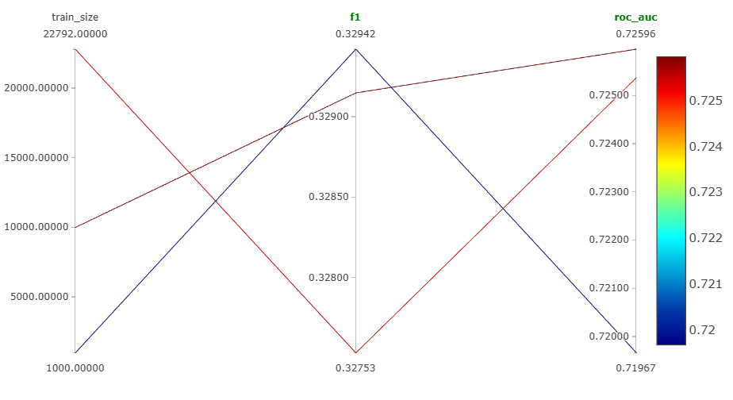
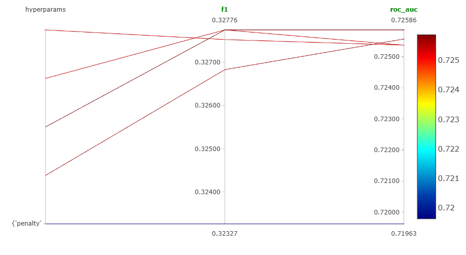
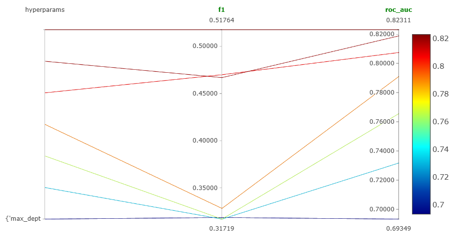

# MLflow эксперименты

---

## 1 Срез

**Гипотеза:**  
Увеличение размера тренировочного датасета повышает метрики модели.

**Параметр:**  
Размер тренировочного датасета (`train_size`)  

**Сетка значений:**  
1000, 10000, 22792  

| train_size | accuracy | f1     | pr_auc | precision | recall | roc_auc |
|------------|----------|--------|--------|-----------|--------|---------|
| 1000       | 0.795    | 0.329  | 0.515  | 0.766     | 0.210  | 0.720   |
| 10000      | 0.798    | 0.329  | 0.520  | 0.799     | 0.207  | 0.726   |
| 22792      | 0.798    | 0.328  | 0.519  | 0.812     | 0.205  | 0.725   |

**Анализ:**  
При увеличении train_size показатели accuracy и ROC-AUC растут незначительно, а F1-score практически не меняется. Это указывает на то, что модель Logistic Regression достигает плато при размере выборки около 10000–22792  

**Вывод:**  
Гипотеза частично подтверждается: увеличение размера датасета слегка улучшает precision и ROC-AUC, но на F1 и accuracy существенного прироста нет.  

**Ссылка на MLflow:** [Run с лучшим train_size](http://158.160.2.37:5000/#/experiments/7/runs/a3c18dbaa7274b22ba4cbcbad31169b9)

---

## 2 Срез

**Гипотеза:**  
Изменение параметра регуляризации `C` у Logistic Regression на метрики F1 и PR-AUC ROC-AUC

**Параметр:**  
`C` (обратная величина регуляризации)  

**Сетка значений:**  
0.001, 0.01, 0.1, 0.5, 0.99  

| C      | accuracy | f1     | pr_auc | precision | recall | roc_auc |
|--------|----------|--------|--------|-----------|--------|---------|
| 0.001  | 0.798    | 0.323  | 0.516  | 0.821     | 0.201  | 0.720   |
| 0.01   | 0.798    | 0.327  | 0.520  | 0.817     | 0.204  | 0.726   |
| 0.1    | 0.798    | 0.328  | 0.519  | 0.815     | 0.205  | 0.726   |
| 0.5    | 0.798    | 0.328  | 0.519  | 0.815     | 0.205  | 0.725   |
| 0.99   | 0.798    | 0.328  | 0.519  | 0.812     | 0.205  | 0.725   |

**Анализ:**  
Изменение параметра `C` почти не влияет на accuracy и F1-score, PR-AUC и ROC-AUC. Модель устойчива к изменению регуляризации в данном диапазоне.  

**Вывод:**  
Гипотеза не подтвердилась: для выбранной задачи Logistic Regression метрики не зависят сильно от C в данном диапазоне 

**Ссылка на MLflow:** [Run с лучшим C](http://158.160.2.37:5000/#/experiments/7/runs/fcc59887857a47c384451fb60e2adccd)

---

## 3 Срез

**Гипотеза:**  
Существует оптимальная глубина дерева (`max_depth`) для DecisionTreeClassifier, при которой достигаются максимальные значения ROC-AUC и F1-score

**Параметр:**  
`max_depth`  

**Сетка значений:**  
2, 3, 4, 5, 6, 7, 8  

| max_depth | accuracy | f1     | pr_auc | precision | recall | roc_auc |
|-----------|----------|--------|--------|-----------|--------|---------|
| 2         | 0.804    | 0.319  | 0.433  | 0.953     | 0.191  | 0.693   |
| 3         | 0.805    | 0.317  | 0.459  | 0.989     | 0.189  | 0.732   |
| 4         | 0.805    | 0.317  | 0.517  | 0.989     | 0.189  | 0.766   |
| 5         | 0.806    | 0.328  | 0.564  | 0.967     | 0.198  | 0.791   |
| 6         | 0.819    | 0.470  | 0.616  | 0.789     | 0.335  | 0.807   |
| 7         | 0.819    | 0.467  | 0.635  | 0.796     | 0.330  | 0.819   |
| 8         | 0.825    | 0.518  | 0.648  | 0.762     | 0.392  | 0.823   |

**Анализ:**  
При небольших значениях max_depth дерево недообучено. С ростом глубины растут F1-score и PR-AUC, достигая максимума при max_depth = 8. ROC-AUC также увеличивается с глубиной.  

**Вывод:**  
Гипотеза подтвердилась: лучшая глубина дерева для этой задачи - 8. Малые значения глубины недообучают модель 

**Ссылка на MLflow:** [Run с max_depth](http://158.160.2.37:5000/#/experiments/7/runs/05f8180af1b14246920992a41140bd3b)
