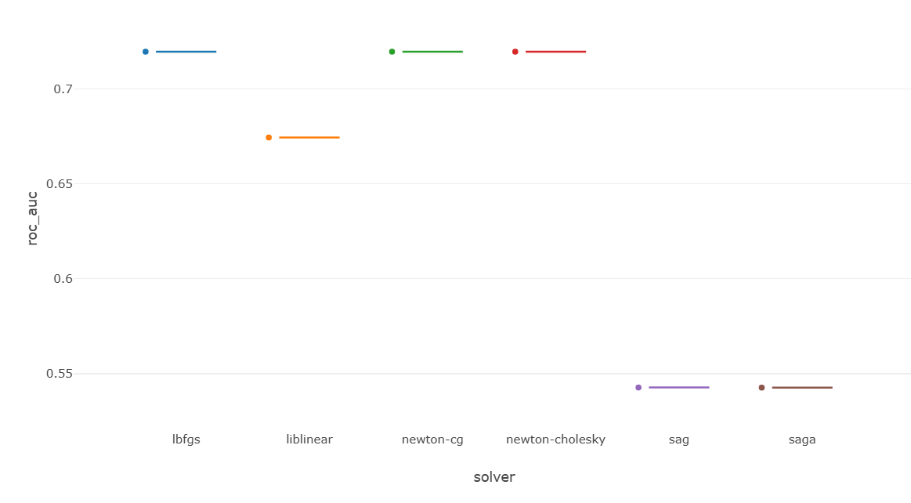
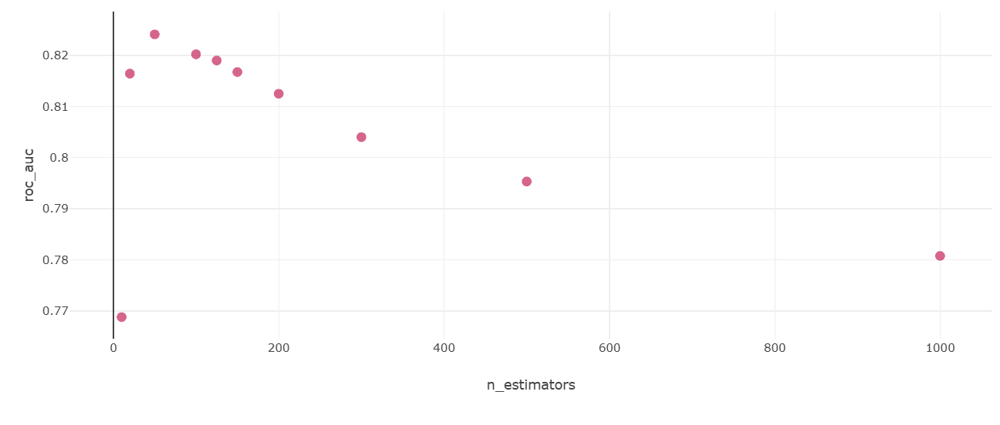
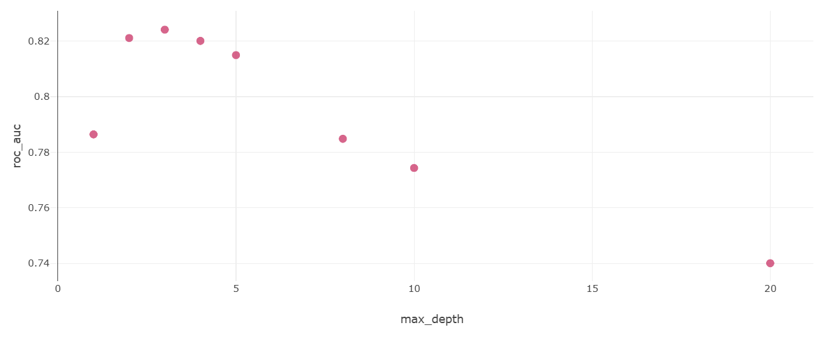
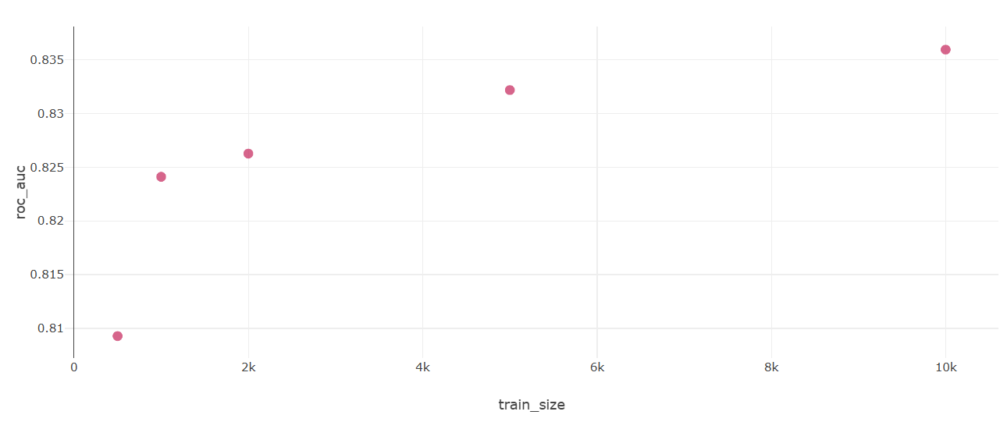

# Отчет по экспериментам MLflow

Ссылка на лучший запуск: http://158.160.2.37:5000/#/experiments/13/runs/97e8b1d90e144441b248bf13710d6661  
ROC-AUC = 0.8359369553137  
features = ['race', 'sex', 'native.country', 'occupation', 'education', 'capital.gain']  
encoder = ordinal  
train_size = 10000  
n_estimators = 50  
learning_rate = 0.1  
max_depth = 3  
random_state = 42  
model_type = gradient_boosting  

---

## разрез 1: влияние алгоритма оптимизации в логистической регрессии
Гипотеза: Различные алгоритмы оптимизации по-разному справляются с ненормализованными табличными данными, что напрямую влияет на качество сходимости модели и итоговую метрику ROC-AUC.  
Исследуемый параметр: solver(алгоритм оптимизации для LogisticRegression)  
Как изменялся: Использовались 6 доступных алгоритмов в scikit-learn: lbfgs, liblinear, newton-cg, newton-cholesky, sag, saga.  
Замороженные параметры: модель логистической регрессии, train_size = 1000, 6 базовых признаков, penalty = l2, max_iter = 1000.  

График зависимости ROC-AUC от выбранного solver:

Выводы: Гипотеза полностью подтвердилась и результаты экспериментов четко разделились на три группы в зависимости от устойчивости алгоритмов к ненормализованным данным. Наилучший и идентичный результат(ROC-AUC ~0.72) показали квазиньютоновские методы lbfgs, newton-cg и newton-cholesky, которые отлично справляются с небольшими выборками и отсутствием масштабирования признаков. Метод liblinear показал средний результат с заметной просадкой в качестве(~0.67). В то же время sag и saga, полностью провалились, выдав качество на уровне случайного угадывания(~0.54). Это наглядно доказывает, что градиентные методы критически чувствительны к сильному разбросу значений в числовых признаках, поэтому без применения предварительной нормализации данных единственными рабочими вариантами для логистической регрессии остаются lbfgs или ньютоновские солверы.  

---

## Разрез 2: Влияние количества деревьев на качество градиентного бустинга 
Гипотеза: Увеличение количества деревьев в ансамбле градиентного бустинга изначально приведет к росту качества предсказаний(модель будет улавливать больше зависимостей), однако после прохождения определенного порога на малом объеме данных(1000 строк) неизбежно начнется переобучение, что выразится в падении метрики ROC-AUC на тестовой выборке.  
Исследуемый параметр: n_estimators(количество базовых алгоритмов в ансамбле)  
Как изменялся: По сетке значений: 10, 20, 50, 100, 125, 150, 200, 300, 500, 1000.
Замороженные параметры: алгоритм Gradient Boosting, learning_rate = 0.1, max_depth = 3, train_size = 1000, 6 базовых признаков.  

График зависимости ROC-AUC от количества деревьев:

Выводы: Гипотеза полностью подтвердилась, и график демонстрирует классическую кривую переобучения градиентного бустинга. На начальном этапе увеличение числа базовых алгоритмов с 10 до 50 приводит к резкому росту качества, так как модель преодолевает недообучение и достигает своего абсолютного максимума ROC-AUC(около ~0.824). Однако сразу после прохождения этого оптимального порога начинается устойчивое и неуклонное падение метрики на тестовой выборке: по мере добавления 100, 300, 500 и 1000 деревьев качество опускается вплоть до ~0.780. Это происходит из-за того, что на крайне малом объеме обучающих данных(всего 1000 строк) при достаточно высоком шаге обучения(0.1) избыточное количество деревьев заставляет ансамбль подстраиваться под шум и выбросы тренировочной выборки, катастрофически теряя способность к обобщению.  

---

## Разрез 3: Влияние глубины деревьев на качество градиентного бустинга
Гипотеза: Увеличение максимальной глубины деревьев до определенного порога позволит модели улавливать более сложные нелинейные взаимодействия между признаками, повышая качество предсказаний. Однако избыточная глубина(особенно на малом наборе данных в 1000 строк) приведет к тому, что деревья начнут просто запоминать тренировочную выборку, что вызовет сильное переобучение ансамбля и резкое падение тестовой метрики ROC-AUC.  
Исследуемый параметр: max_depth  
Как изменялся: По сетке значений: 1, 2, 3, 4, 5, 8, 10, 20.
Замороженные параметры: алгоритм Gradient Boosting, n_estimators = 50, learning_rate = 0.1, train_size = 1000, 6 базовых признаков.  

График сравнения ROC-AUC по глубине деревьев:
  

Выводы: гипотеза полностью подтвердилась, и график демонстрирует ярко выраженную зависимость качества от сложности суммируемых деревьев. На начальном этапе переход от деревьев глубины 1 к глубине 3 позволяет модели улавливать полезные нелинейные взаимодействия признаков, что приводит к быстрому росту качества и достижению абсолютного оптимума ROC-AUC на уровне ~0.825. Однако любое последующее увеличение параметра max_depth(4, 5 и далее) вызывает падение метрики на тестовой выборке, которое при экстремальной глубине 20 обрушивается до худшего показателя в ~0.740. Такое поведение обусловлено тем, что на крайне малом объеме данных(1000 строк) глубокие деревья получают избыточную свободу и начинают выстраивать слишком сложные ветвления, фактически заучивая тренировочную выборку наизусть вместе с ее шумом.  

---

## Разрез 4: Влияние размера тренировочного датасета на качество градиентного бустинга
Гипотеза: Увеличение объема тренировочных данных предоставит модели больше репрезентативных примеров для изучения реальных закономерностей(а не шума), что приведет к плавному и уверенному росту обобщающей способности алгоритма и увеличению метрики ROC-AUC на тестовой выборке.  
Исследуемый параметр: train_size  
Как изменялся: По сетке значений: 500, 1000, 2000, 5000, 10000.
Замороженные параметры: алгоритм Gradient Boosting, n_estimators = 50, learning_rate = 0.1, max_depth = 3, 6 базовых признаков.  

График сравнения ROC-AUC по размеру обучающего датасета:
   

Выводы: Гипотеза полностью подтвердилась - график демонстрирует строгую монотонно возрастающую зависимость качества предсказаний от объема тренировочной выборки. Наиболее резкий скачок метрики(с ~0.809 до ~0.824) наблюдается на начальном этапе при переходе от 500 строк к 1000, что свидетельствует о нехватке информации для обучения алгоритма на старте. При дальнейшем увеличении объема данных до 2000, 5000 и 10000 строк рост ROC-AUC ожидаемо замедляется, но остается стабильно уверенным, достигая максимального показателя около ~0.836. Подобная динамика доказывает, что градиентный бустинг крайне чувствителен к объему обучающей выборки и эффективно использует новую порцию информации для уточнения. Кроме того, отсутствие явного визуального выхода графика на плато в точке 10000 строк говорит о том, что информационная емкость модели с заданными гиперпараметрами еще не исчерпана.